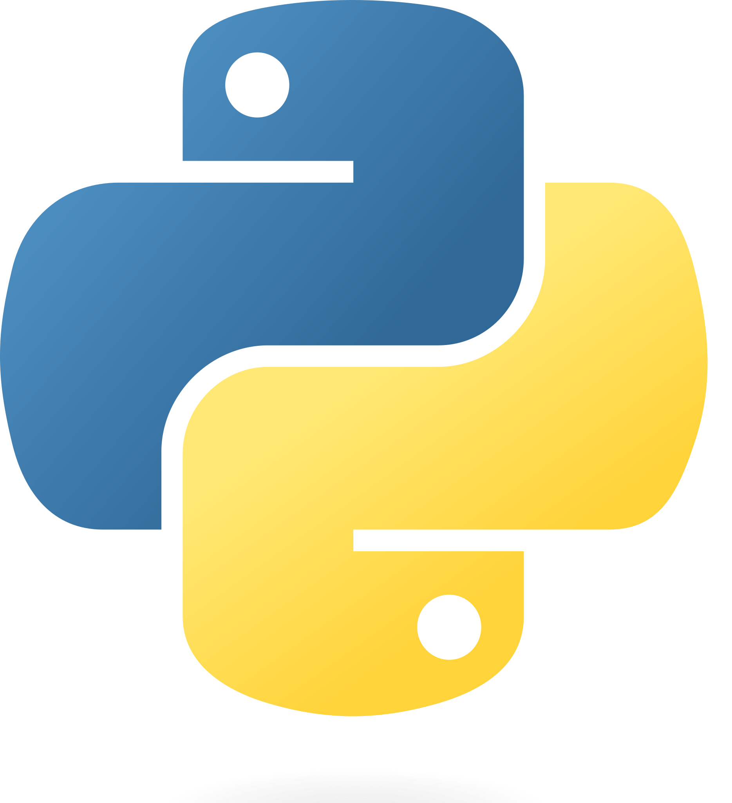

<h1 id="title" align="center">Welcome to Rob-Bhit</h1>
<h2 id="subtitle" align="center">Your friendly neighbourhood robot fit monitoring system</h3>

## 🤖 What is Rob-Bhit?

Rob-Bhit is a phone app that I developed to be used with an Industrial Edge Device (IED) that can monitor machine health.

## 🌐 Technologies

-  Flutter
-  Python
-  Flask

## ✨ Features

- 📱 Interactive way of viewing data with phone
- ᯤ Can be connected through Local Area Network (LAN) wirelessly
- 📦 Easy to set up and integrate with Docker

## 🚀 Getting Started

There are 2 parts to the set up, the Backend and the Frontend

### 📝 Pre-Requesites

Docker Desktop. If you don't have it installed, you can download it <a href="https://www.docker.com/products/docker-desktop/">here</a>. Once you have Docker Desktop installed, start the program.

### Backend

Run these commands to download and start the python backend server
```
git clone https://github.com/IAmSmolBoy/Rob-Bhit.git
cd Rob-Bhit/Backend
ipconfig
```
<p>After running ipconfig, you will be able to see your machine's ip under Wireless LAN adapter Wi-Fi > IPv4 Address. Remember this ip.</p>
After that, Start the Docker Engine by starting the Docker Desktop program.

```
docker-compose up --build -d db
docker-compose up --build -d data-extraction
docker-compose up --build api
```

Frontend

```
cd Flutter
flutter build apk --release
```

You will find an apk file in the path. Rob-Bhit/Frontend/build/app/outputs/apk/release/app-release.apk.
<p>app-release.apk is an apk file that can be downloaded and installed onto an Android phone.</p>
<p>When you enter Rob-Bhit, go to settings and you will have to enter in the ip you saw after running ipconfig.</p>

<link rel=“stylesheet” type=“text/css” href=”assets/md/README.css”>
